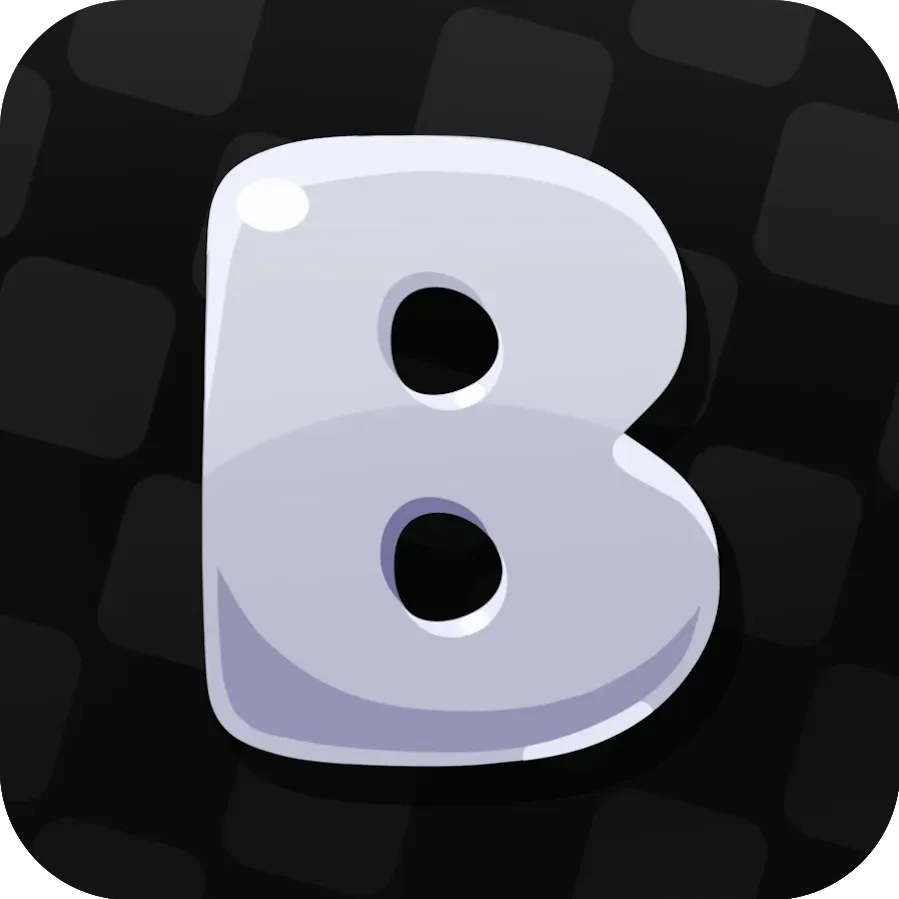
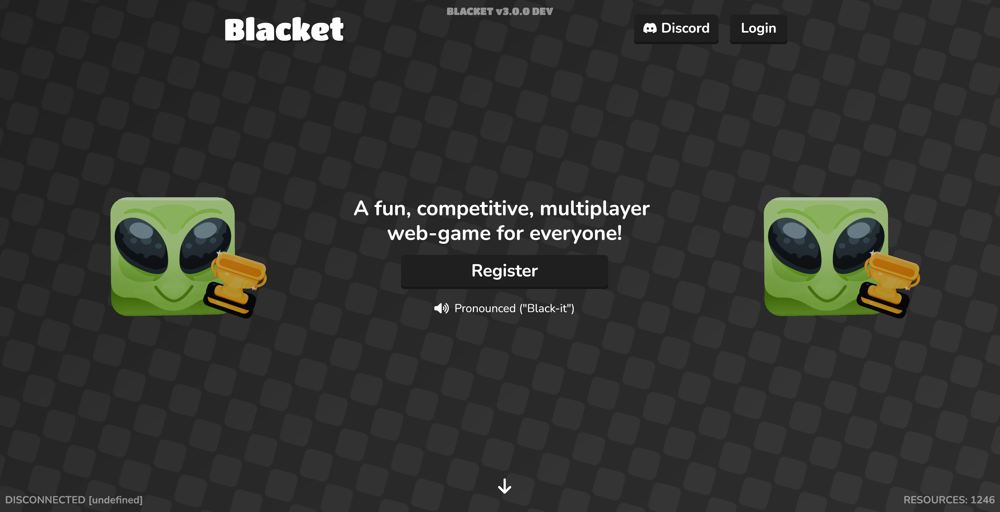

<!-- ellie/vienna contributed to this readme -->
<!-- Cover -->
<h1 id="top" align="center">
	
	 
	Blacket
	 
</h1>

<h4 align="center">A Blooket inspired game with countless additional features for your enjoyment.</h4>

<!-- Badges -->

	
	
	
	
	
	
	

	

<!-- Navigation -->

	<a href="#features">Features</a> •
    <a href="#selfhost">Selfhosting</a> •
    <a href="#credits">Credits</a> •
	<a href="#license">License</a>

## Features

Blacket is a Blooket inspired game with many many additional features when compared to Blooket, we're also always looking for new exciting features to add to the game so feel free to suggest them over at our Discord! Here are some of the features we have so far:

<table>
	<tr>
		<td width="33%" valign="top">
			
			
Custom packs inspired by Blooket

		</td>
		<td width="33%" valign="top">
			
			
Custom blooks inspired by Blooket

		</td>
		<td width="33%" valign="top">
			
			
Trade blooks and items with other players in a safe system.

		</td>
	</tr>
	<tr>
		<td width="33%" valign="top">
			
			
Jump into live games with friends or public lobbies.

		</td>
		<td width="33%" valign="top">
			
			
Climb global and seasonal leaderboards across modes.

		</td>
		<td width="33%" valign="top">
			
			
Chat in game with moderation tools and filters.

		</td>
	</tr>
	<tr>
		<td width="33%" valign="top">
			
			
Manage friends, send invites, and see who is online.

		</td>
		<td width="33%" valign="top">
			
			
Bid on rare blooks and items in timed auctions.

		</td>
		<!--<td width="33%" valign="top">
			
			
Secure payments for optional upgrades and cosmetics.

		</td>-->
	</tr>
</table>

(<a href="#top">back to top</a>)

## Selfhost

⚠️ UNDER CONSTRUCTION ⚠️

Selfhosting instructions will be available once Blacket V3 is in a release ready state. Feel free to try setting it up yourself in the meantime but we provide no support or help with this.

(<a href="#top">back to top</a>)

## Credits

These amazing people have contributed greatly to Blacket over it's development:
- [Xotic](https://codeberg.org/Xotic) - Lead Developer and founder of Blacket
- [allie] - Developer for Blacket V3 <!-- add ur github/codeberg -->
- [ellie](https://codeberg.org/buttercoffee) - Developer/Tester for Blacket V3
- [tboyj](https://codeberg.org/tboyj) - Developer/Tester for Blacket V3

(<a href="#top">back to top</a>)

## License

Distributed under the GPL-3.0 License. See `LICENSE` for more information.

(<a href="#top">back to top</a>)

---

The above README is a work in progress and will be updated with previews as well as other information as we get closer to a release ready state for Blacket V3. Feel free to make a PR to improve this README with some writeups, etc.
